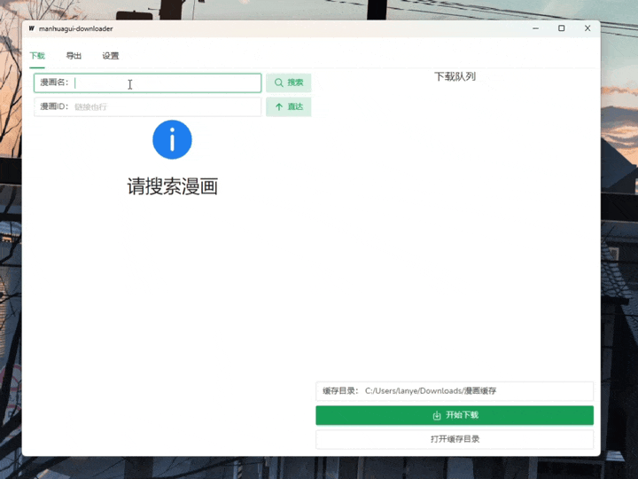
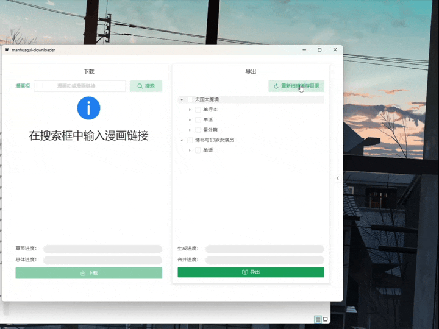

# manhuagui-downloader 漫画柜下载器

一个用于 manhuagui.com 看漫画 漫画柜 的下载器

在[Release页面](https://github.com/lanyeeee/manhuagui-downloader/releases)可以直接下载，带图形界面，支持导出PDF，免安装版(portable)解压后可以直接运行，**建议下载安装版，免安装版容易被杀毒软件误判为病毒**

# 图形界面

### 下载

默认下载目录为 `C:/Users/[你的用户名]/Downloads/漫画缓存`



### 导出

默认导出目录为`C:/Users/[你的用户名]/Downloads/漫画导出`



### 注意

中国大陆访问 [漫画柜](https://www.manhuagui.com) 是需要代理的，每次打开软件时会自动检测并使用系统代理

可以前往 **设置** -> **代理地址** 调整，清空则不使用代理


# 如何构建(build)

如果你是普通用户请忽略这部分内容

### 前提

- [Go 1.18+](https://go.dev/dl/)
- [NPM (Node 15+)](https://nodejs.org/en)

### 安装Wails

```
go install github.com/wailsapp/wails/v2/cmd/wails@latest
```

### 克隆本仓库

```
git clone https://github.com/lanyeeee/manhuagui-downloader.git
```

### 构建(build)

```
cd manhuagui-downloader
wails build
```

# License 许可证

[MIT](LICENSE)
