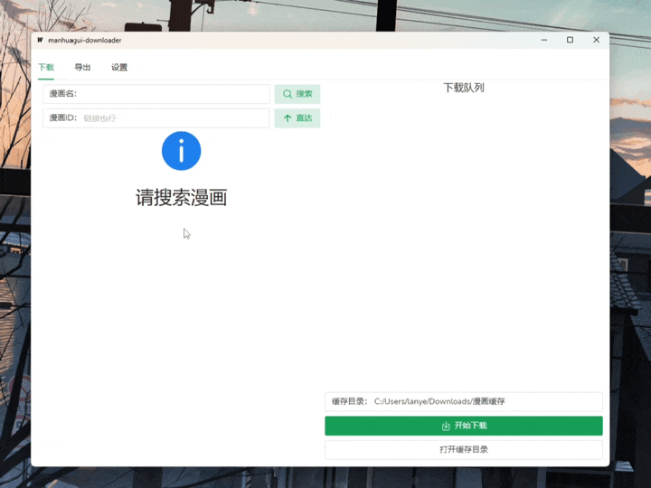
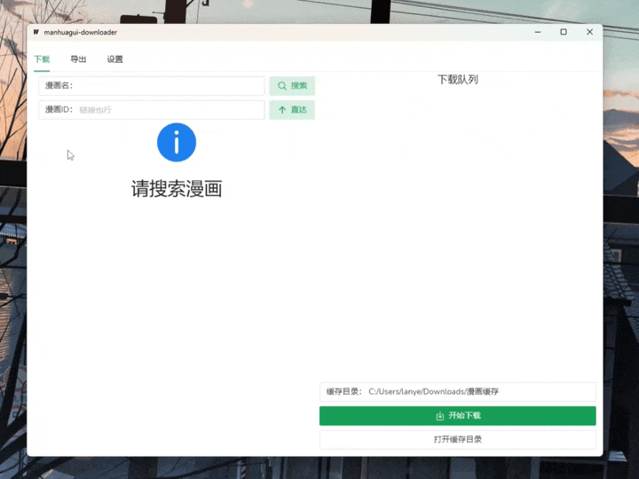
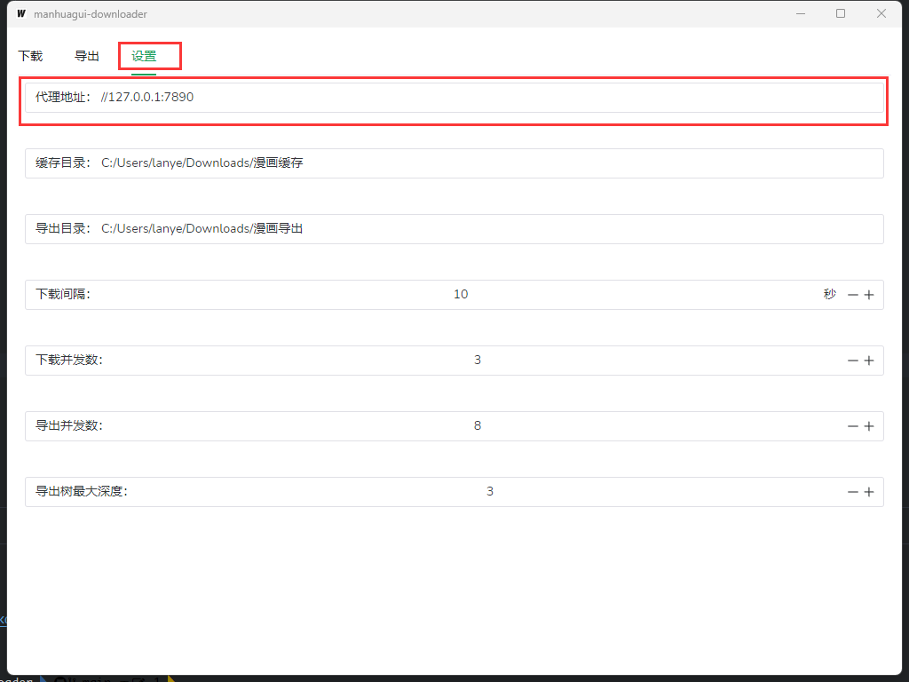

> # ⚠️ 重要通知
> 
> **本项目已完成重写，并迁移至新仓库：[manhuagui-downloader](https://github.com/lanyeeee/manhuagui-downloader)**
> 
> 这个仓库将不再维护，新版本提供了更好的用户体验，建议所有用户迁移到新版本


# 漫画柜下载器

<p align="center">
    
</p>

一个用于 manhuagui.com 看漫画 漫画柜 的下载器，带图形界面，支持下载隐藏内容、导出PDF，免安装版(portable)解压后可以直接运行。

在[Release页面](https://github.com/lanyeeee/manhuagui-downloader-wails/releases)可以直接下载

**如果本项目对你有帮助，欢迎点个 Star⭐ 支持！你的支持是我持续更新维护的动力🙏**

# 图形界面

### 下载

默认下载目录为 `C:/Users/[你的用户名]/Downloads/漫画缓存`



### 导出

默认导出目录为`C:/Users/[你的用户名]/Downloads/漫画导出`



### 注意

中国大陆访问 [漫画柜](https://www.manhuagui.com) 是需要代理的，每次打开软件时会自动检测并使用系统代理

可以前往 **设置** -> **代理地址** 调整，清空则不使用代理



# 关于被杀毒软件误判为病毒

这个问题几乎是无解的(~~需要数字证书给软件签名，甚至给杀毒软件交保护费~~)  
我能想到的解决办法只有：
1. 根据下面的**如何构建(build)**，自行编译
2. 希望你相信我的承诺，我承诺你在[Release页面](https://github.com/lanyeeee/manhuagui-downloader-wails/releases)下载到的所有东西都是安全的

# 如何构建(build)

构建非常简单，一共就3条命令  
~~前提是你已经安装了Go和Node~~

### 前提

- [Go 1.18+](https://go.dev/dl/)
- [NPM (Node 15+)](https://nodejs.org/en)

### 步骤

#### 1. 安装Wails

```
go install github.com/wailsapp/wails/v2/cmd/wails@latest
```

#### 2. 克隆本仓库

```
git clone https://github.com/lanyeeee/manhuagui-downloader-wails.git
```

#### 3. 构建(build)

```
cd manhuagui-downloader-wails
wails build
```
# 其他
任何使用中遇到的问题、任何希望添加的功能，都欢迎提issue，我会尽力解决  

# License 许可证

[MIT](LICENSE)
